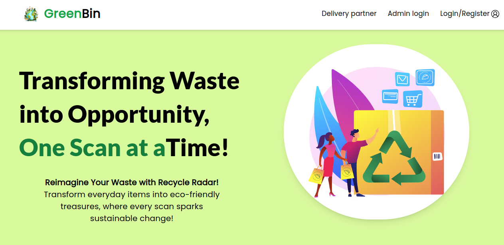
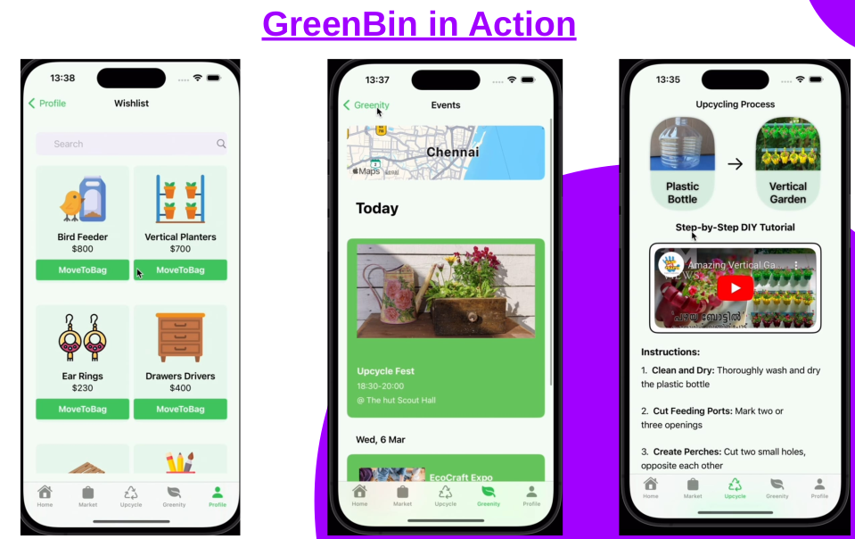

# Green Titans 🌍🌱

Welcome to **Green Titans** — a global movement starting with local actions!  
Our flagship website, **GreenBin**, revolutionizes the way we manage waste, empowering individuals to make eco-friendly decisions and contribute to a sustainable future.

## 🌟 Project Theme:  
**Integrating Generative AI for Environmental Sustainability and Creative AI Innovation**  
The evolution of technology thrives on scaling infrastructure efficiently. Green Titans aligns with this mission by leveraging advanced tech solutions to optimize and scale cloud infrastructure with sustainability in mind.  

## 💡 Vision  
The world is at the cusp of a green revolution. As urban sectors expand and cloud solutions drive innovation, the Green Titans are committed to making cities smarter, more livable, and environmentally conscious. By integrating green cloud technology, we aim to create an impact that starts small and resonates globally.

---

## 🎯 Objective  
Our goal is simple but powerful: **Empower users to identify, reduce, and repurpose waste** using cutting-edge technology. By turning waste into a resource, we help pave the way for a sustainable future.

---

## 🚀 GreenBin : Transforming Waste into Opportunity, One Scan at a Time

**GreenBin**, developed by the Green Warriors team, is designed to revolutionize waste management by making recycling intuitive, educational, and rewarding. With this website, users can easily identify, upcycle, and repurpose waste materials, fostering a lifestyle of sustainability.  

## 📱 Website Demo:

https://drive.google.com/file/d/19BP85O5LA7DvId2cqABIZikRFoMX5roC/view?usp=drivesdk

---

--- 

## 📱 App Demo:

https://www.youtube.com/watch?v=630HUrYcflU

---

--- 

### 🌿 Empowering Change Through Knowledge, Action, and Advocacy:
1. **Consumer Empowerment:**
   - Provides users with information on various waste materials and offers creative upcycling ideas.
   - Encourages responsible consumption, helping reduce waste.
  
2. **Educational Resource:**
   - A rich resource to learn about the environmental impact of waste and sustainable practices.
   - Engages users with tutorials and a vibrant community that shares knowledge on recycling and upcycling.

3. **Advocating for Sustainability:**
   - Acts as a platform for promoting eco-friendly practices and supporting environmental causes.
   - Collaborates with environmental organizations to maximize its reach and impact.

--- 

## 📱 Applications
**Green Bin** is designed to be a powerful tool for:
1. **Consumers**: Helping individuals make informed choices and adopt a sustainable lifestyle.
2. **Educators**: Providing schools and organizations with a valuable resource to teach sustainability.
3. **Activists & NGOs**: Advocating for eco-friendly practices and driving positive change.

---

## 🌐 Scaling Cloud for Smart Cities  
Green Titans integrates **green cloud** technology to ensure sustainability at the infrastructure level. Our scalable cloud solutions:
- **Optimize** cloud infrastructure to minimize environmental impact.
- **Enhance** urban sectors by driving innovation in smart cities, making them more livable, sustainable, and accessible.

---

Join us in **Transforming Waste into Opportunity, One Scan at a Time**!
